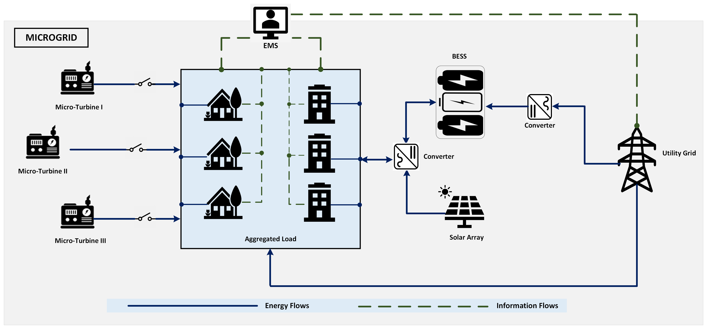
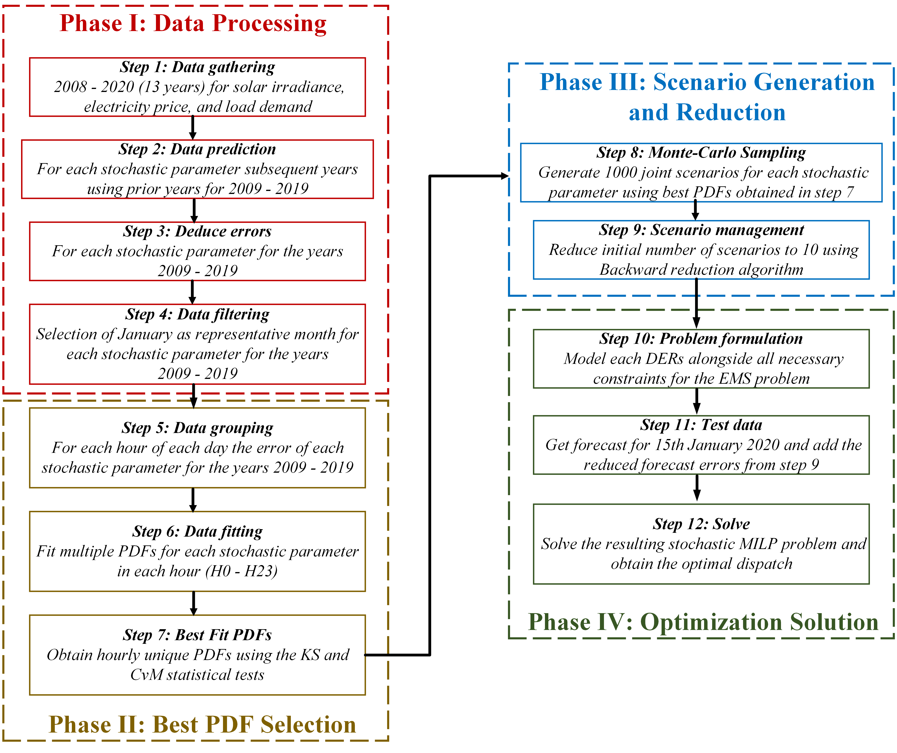

# Data-Driven Hourly PDF Selection for Microgrid Day-Ahead Energy Management Under Uncertainties


This repository provides the research code, datasets, and computational workflow for a data-driven stochastic energy management framework for grid-connected microgrids. The project studies how hourly probability distribution functions (PDFs), selected from empirical forecasting errors, influence day-ahead microgrid scheduling under uncertain load demand, solar irradiance, and electricity prices.

The central idea is simple: instead of assuming one fixed probability distribution for all forecast errors, the framework identifies the best-fitting PDF for each stochastic parameter at each hour and uses those hourly PDFs to generate scenarios for stochastic optimization.

---

## Project Overview

This project implements an end-to-end workflow for uncertainty-aware microgrid energy management. It includes:

1. **Time-series forecasting**: Forecast load demand, electricity price, and solar irradiance using XGBoost-based prediction notebooks.
2. **Forecast error analysis**: Derive hourly forecast errors from historical predictions.
3. **Hourly PDF fitting**: Fit candidate distributions to forecast errors for each stochastic variable and each hour.
4. **Goodness-of-fit testing**: Select best-fit PDFs using Kolmogorov-Smirnov (KS) and Cramer-von Mises (CvM) statistical tests.
5. **Scenario generation and reduction**: Generate Monte Carlo scenarios and reduce them using the backward reduction method.
6. **Stochastic optimization**: Solve a day-ahead energy management problem for a grid-connected microgrid with distributed energy resources.

The workflow is designed for researchers and practitioners working on microgrid scheduling, uncertainty modelling, distributed energy resources, and stochastic optimization.

---

## Associated Publication

This repository accompanies the following research article:

> Esan, A. B., Shareef, H., ALAhmad, A. K., & Oghorada, O. (2025). **Analysis and Impact of Data-Driven Hourly Probability Distribution Functions in Microgrids Day-Ahead Energy Management under Uncertainties: A Case Study in New South Wales, Australia**. *IET Renewable Power Generation*, 19(1), Article e70146. https://doi.org/10.1049/rpg2.70146

---

## Microgrid System Schematic

<p align="center">
  
</p>

The studied system represents a grid-connected microgrid with micro-turbines, a solar photovoltaic array, a battery energy storage system (BESS), aggregated local demand, utility grid interaction, and an energy management system (EMS). Energy flows connect the distributed resources, storage, loads, and grid, while information flows enable the EMS to coordinate decisions for day-ahead operation.

---

## Methodological Workflow

<p align="center">
  
</p>

The methodology is organized into four main phases:

### Phase I: Data Processing

Historical data are gathered for solar irradiance, electricity price, and load demand. Forecasts are generated for subsequent years, and forecast errors are computed for each stochastic parameter.

### Phase II: Best PDF Selection

Forecast errors are grouped by hour. Multiple probability distributions are fitted to each hourly error set, and the best-fit PDFs are selected using KS and CvM goodness-of-fit tests.

### Phase III: Scenario Generation and Reduction

The selected hourly PDFs are used to generate joint stochastic scenarios through Monte Carlo sampling. The scenario set is then reduced to a smaller representative set using backward reduction.

### Phase IV: Optimization Solution

The reduced scenarios are incorporated into a stochastic mixed-integer linear programming (MILP) formulation of the microgrid energy management problem. The resulting model determines the optimal day-ahead dispatch of distributed energy resources, storage, and grid power exchange.

---

## Case Study and Data Description

The case study focuses on day-ahead energy management for a hypothetical grid-connected microgrid in New South Wales, Australia.

| Component | Description |
|---|---|
| Stochastic parameters | Load demand, solar irradiance, and electricity price |
| Forecasting model | XGBoost-based time-series forecasting |
| Error modelling | Hourly forecast error fitting across candidate PDFs |
| Goodness-of-fit tests | Kolmogorov-Smirnov and Cramer-von Mises |
| Scenario generation | Monte Carlo sampling |
| Scenario reduction | Backward reduction method |
| Optimization model | Stochastic MILP for day-ahead energy management |
| Test day | 15 January 2020 |

The repository includes rolling historical datasets for demand, electricity price, and solar irradiance. These datasets support the forecasting, uncertainty modelling, and optimization stages of the workflow.

---

## Repository Structure

```text
Data-Driven-Hourly-PDF-in-Microgrid-Day-Ahead-Energy-Management-Under-Uncertainties/
|
|-- Electricity Price Datasets/
|   |-- 2008_2013_price.csv
|   |-- 2008_2014_price.csv
|   |-- 2008_2015_price.csv
|   |-- 2008_2016_price.csv
|   |-- 2008_2017_price.csv
|   |-- 2008_2018_price.csv
|   |-- 2008_2019_price.csv
|   |-- 2008_2020_price.csv
|
|-- Load Demand Datasets/
|   |-- 2008_2013_demand.csv
|   |-- 2008_2014_demand.csv
|   |-- 2008_2015_demand.csv
|   |-- 2008_2016_demand.csv
|   |-- 2008_2017_demand.csv
|   |-- 2008_2018_demand.csv
|   |-- 2008_2019_demand.csv
|   |-- 2008_2020_demand.csv
|
|-- Solar Irradiance Datasets/
|   |-- 2011_2013_solar.csv
|   |-- 2011_2014_solar.csv
|   |-- 2011_2015_solar.csv
|   |-- 2011_2016_solar.csv
|   |-- 2011_2017_solar.csv
|   |-- 2011_2018_solar.csv
|   |-- 2011_2019_solar.csv
|   |-- 2011_2020_solar.csv
|
|-- Generator and Battery Dataset/
|   |-- Microgrid Battery Parameters.csv
|   |-- Microgrid Generator Parameters.csv
|
|-- Stochastic Parameter Predictions with XGBoost - Stage I/
|   |-- Demand Predictions/
|   |   |-- TS_prediction_demand_I.ipynb
|   |   |-- TS_prediction_demand_II.ipynb
|   |   |-- TS_prediction_demand_III.ipynb
|   |   |-- TS_prediction_demand_IV.ipynb
|   |   |-- TS_prediction_demand_V.ipynb
|   |   |-- TS_prediction_demand_VI.ipynb
|   |   |-- TS_prediction_demand_VII.ipynb
|   |   |-- TS_prediction_demand_VIII.ipynb
|   |
|   |-- Price Predictions/
|   |   |-- TS_prediction_price_I.ipynb
|   |   |-- TS_prediction_price_II.ipynb
|   |   |-- TS_prediction_price_III.ipynb
|   |   |-- TS_prediction_price_IV.ipynb
|   |   |-- TS_prediction_price_V.ipynb
|   |   |-- TS_prediction_price_VI.ipynb
|   |   |-- TS_prediction_price_VII.ipynb
|   |   |-- TS_prediction_price_VIII.ipynb
|   |
|   |-- Solar Irradiance Predictions/
|       |-- TS_prediction_solar_I.ipynb
|       |-- TS_prediction_solar_II.ipynb
|       |-- TS_prediction_solar_III.ipynb
|       |-- TS_prediction_solar_IV.ipynb
|       |-- TS_prediction_solar_V.ipynb
|       |-- TS_prediction_solar_VI.ipynb
|       |-- TS_prediction_solar_VII.ipynb
|       |-- TS_prediction_solar_VIII.ipynb
|
|-- Stochastic Modelling - Stage II/
|   |-- Stochastic Modelling - Stage II/
|       |-- Code 1 - Load Demand Modelling.ipynb
|       |-- Code 2 - Electricity Price Modelling.ipynb
|       |-- Code 3 - Solar Irradiance Modelling.ipynb
|
|-- Stochastic Optimization - Stage III/
|   |-- Stochastic Optimization - Stage III/
|       |-- Problem Formulation and Stochastic Optimization.ipynb
|
|-- docs/
|   |-- figures/
|       |-- microgrid_schematic.png
|       |-- methodology_workflow.png
|
|-- LICENSE
|-- README.md
```

---

## Software Requirements

The notebooks can be run in Google Colab or in a local Jupyter environment. A typical local setup requires Python 3.10 or later and the following packages:

```bash
python -m pip install pandas numpy scipy matplotlib seaborn scikit-learn xgboost statsmodels prophet openpyxl mip jupyter
```

Core package roles are summarized below.

| Package | Purpose |
|---|---|
| `pandas`, `numpy` | Data handling and numerical computation |
| `matplotlib`, `seaborn` | Visualization |
| `xgboost`, `scikit-learn` | Time-series prediction and model evaluation |
| `statsmodels`, `prophet` | Time-series analysis support |
| `scipy` | Statistical distributions and goodness-of-fit testing |
| `mip` | Mixed-integer optimization |
| `pickle` | Storage and retrieval of intermediate forecast and scenario objects |

---

## How to Run the Project

### 1. Clone the repository

```bash
git clone https://github.com/esanben/Data-Driven-Hourly-PDF-in-Microgrid-Day-Ahead-Energy-Management-Under-Uncertainties.git
cd Data-Driven-Hourly-PDF-in-Microgrid-Day-Ahead-Energy-Management-Under-Uncertainties
```

### 2. Run Stage I: Stochastic parameter prediction

Run the notebooks in:

```text
Stochastic Parameter Predictions with XGBoost - Stage I/
```

This stage generates forecasts and forecast errors for:

- Load demand
- Electricity price
- Solar irradiance

The rolling notebooks estimate each stochastic parameter over historical training windows and generate year-specific prediction outputs.

### 3. Run Stage II: Stochastic modelling

Run the notebooks in:

```text
Stochastic Modelling - Stage II/Stochastic Modelling - Stage II/
```

This stage fits candidate PDFs to the hourly forecast errors and selects the most representative distributions using statistical goodness-of-fit tests.

### 4. Run Stage III: Stochastic optimization

Run:

```text
Stochastic Optimization - Stage III/Stochastic Optimization - Stage III/Problem Formulation and Stochastic Optimization.ipynb
```

This stage uses the selected PDFs and reduced scenarios to solve the microgrid day-ahead energy management problem.

---

## Expected Outputs

Running the full workflow produces:

- Time-series forecasts for stochastic parameters.
- Forecast error datasets for load, price, and solar irradiance.
- Hourly best-fit PDFs for each stochastic variable.
- Monte Carlo scenarios and reduced representative scenarios.
- Day-ahead dispatch decisions for the microgrid.
- Operating cost estimates under uncertainty-aware scheduling.

---

## Key Contributions

This repository demonstrates a research workflow with the following contributions:

1. A data-driven approach for selecting hourly unique PDFs from empirical forecast errors.
2. A structured uncertainty modelling pipeline for microgrid stochastic parameters.
3. Scenario generation and reduction for tractable stochastic optimization.
4. Integration of forecasting, statistical learning, and MILP-based energy management.
5. Open research code supporting reproducibility and extension in microgrid EMS studies.

---

## Reproducibility Notes

- Some notebooks rely on intermediate `.pickle` files generated in earlier stages. Run the notebooks in sequence.
- Several notebooks use relative file paths. If running locally, ensure that each notebook is executed from the folder containing its required input files, or update file paths accordingly.
- For Monte Carlo sampling, set random seeds in the relevant cells if exact numerical reproducibility is required.
- The repository is intended for academic research and reproducibility. Additional refactoring may be useful before production deployment.

---

## License

This project is licensed under the [MIT License](LICENSE). You are free to use, modify, and share this work with proper attribution.

---

## About the Author

I am **Ayodele Benjamin Esan**. I hold a doctorate in Electrical Engineering with a focus on Deep Reinforcement Learning applications in energy systems. I am passionate about data engineering, optimization, and intelligent energy management systems.

Feel free to connect with me:

[](https://www.linkedin.com/in/ayodele-benjamin-esan-ph-d-03b948106/)
[](https://github.com/esanben)
[](https://medium.com/@esanayodele.benjamin)
